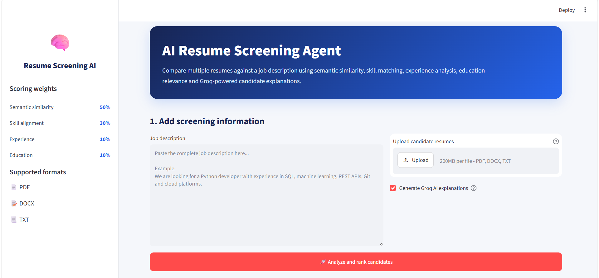
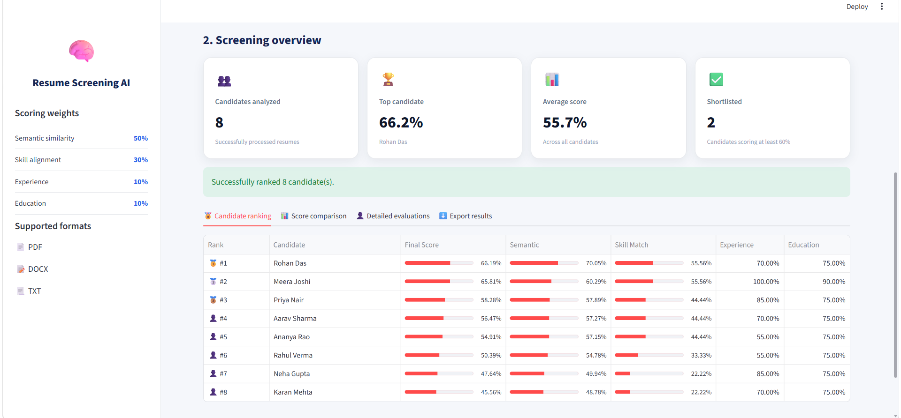
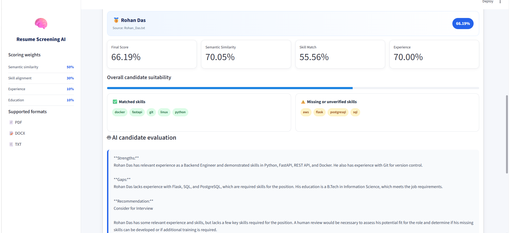

# 🤖 AI Resume Screening Agent

An AI-powered resume screening application that automatically evaluates and ranks multiple candidate resumes against a job description using semantic similarity, skill matching, experience analysis, education relevance and AI-generated explanations.

Developed as part of the **Rooman Technologies 24-Hour AI Agent Challenge**, this project helps recruiters streamline the initial candidate screening process by combining deterministic scoring with Large Language Model (LLM) insights.

## 📌 Project Overview

Traditional resume screening is time-consuming and subjective. This application automates the first stage of recruitment by analyzing resumes and comparing them against a given job description.

The system:

- Accepts a job description
- Parses multiple resumes (PDF, DOCX, TXT)
- Extracts relevant information
- Computes multiple evaluation scores
- Ranks candidates automatically
- Generates AI-powered strengths and gap analysis
- Exports results as CSV and JSON

The final ranking is based on a weighted scoring system, while the LLM provides human-readable explanations without affecting the numerical score.

---

## ✨ Features

## Resume Processing

- Upload multiple resumes simultaneously
- Supports PDF, DOCX, and TXT formats
- Automatic resume parsing and text extraction
- Handles batches of 10+ resumes efficiently

## Intelligent Candidate Evaluation

- Semantic similarity matching between resume and job description
- Skill extraction and comparison
- Experience relevance evaluation
- Education relevance evaluation
- Weighted final candidate score
- Automatic candidate ranking

## AI-Assisted Analysis

- AI-generated candidate summaries
- Strengths identification
- Missing or unverified skills detection
- Recruiter-friendly explanations using Groq LLM

## Export Support

- Download ranked candidates as CSV
- Download ranked candidates as JSON

## User Interface

- Modern Streamlit interface
- Interactive score cards
- Candidate-wise expandable reports
- Visual skill tags
- Download buttons for results

---

## 🏗️ System Architecture

The application follows a modular pipeline:

1. **Job Description Input**
   - Recruiter provides the job description.

2. **Resume Parser**
   - Extracts text from PDF, DOCX, and TXT resumes.

3. **Information Extraction**
   - Identifies skills, education, and experience.

4. **Scoring Engine**
   - Computes:
     - Semantic Similarity (50%)
     - Skill Match (30%)
     - Experience (10%)
     - Education (10%)

5. **LLM Analysis**
   - Groq generates candidate strengths, gaps, and recommendations.

6. **Ranking & Export**
   - Candidates are ranked and exported as CSV and JSON.

7. **Streamlit Dashboard**
   - Displays rankings, detailed reports, and download options.

### Workflow

1. Enter the job description.
2. Upload one or more resumes.
3. The system extracts candidate information and computes scores.
4. Candidates are ranked and AI explanations are generated.
5. Download the results as CSV or JSON.

## 🛠️ Tech Stack

The project is built using the following technologies:

- **Python** – Core programming language
- **Streamlit** – Interactive web interface
- **Groq API** – AI-generated candidate analysis
- **Sentence Transformers** – Semantic similarity between resumes and job descriptions
- **PyPDF2 & python-docx** – Resume parsing
- **Pandas** – Data processing and result generation
- **python-dotenv** – Environment variable management
- **CSV & JSON** – Exporting ranked candidate data

## 📁 Project Structure

```text
ResumeScreeningAI/
│
├── app.py
├── requirements.txt
├── README.md
├── .env.example
├── .gitignore
│
├── assets/
│   ├── home.png
│   ├── ranking.png
│   ├── candidate_details.png
│   └── export.png
│
├── data/
│   ├── job_descriptions/
│   └── resumes/
│
├── outputs/
│   ├── ranked_candidates.csv
│   └── ranked_candidates.json
│
└── src/
    ├── parser.py
    ├── scorer.py
    ├── skills.py
    ├── llm.py
    └── __init__.py
```

## ⚙️ Installation

### Clone the repository

```bash
git clone https://github.com/gourisnayak/AI_Resume_Screening_Agent.git
cd AI_Resume_Screening_Agent
```

### Create a virtual environment

**Windows**

```bash
python -m venv .venv
.venv\Scripts\activate
```

**Linux / macOS**

```bash
python3 -m venv .venv
source .venv/bin/activate
```

### Install dependencies

```bash
pip install -r requirements.txt
```
## 🔑 Environment Setup

## 🔑 Environment Setup

Create a `.env` file in the project root by copying `.env.example`.

```env
GROQ_API_KEY=your_groq_api_key
```

Replace `your_groq_api_key` with your own Groq API key.
```
## ▶️ Running the Application

Start the Streamlit application using:

```bash
streamlit run app.py
```

Once the application starts, open the local URL displayed in the terminal (typically `http://localhost:8501`).

### Using the Application

1. Paste the job description into the input box.
2. Upload one or more resumes (PDF, DOCX, or TXT).
3. (Optional) Enable AI-generated candidate analysis.
4. Click **Analyze & Rank Candidates**.
5. Review the ranked candidates and download the results as CSV or JSON.

## 📸 Application Screenshots

### Home Screen



### Candidate Ranking



### Candidate Details



## 🚀 Future Improvements

Although the current system effectively automates resume screening, there are several opportunities to enhance its capabilities in future versions:

- Support OCR for scanned and image-based resumes.
- Improve skill extraction using advanced NLP and Named Entity Recognition (NER) models.
- Allow recruiters to customize scoring weights based on job requirements.
- Integrate a database to store candidate profiles and screening history.
- Deploy the application to a cloud platform for public access.
- Add authentication and role-based access for recruiters.